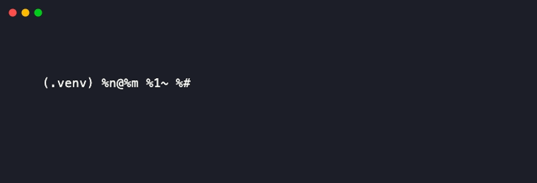
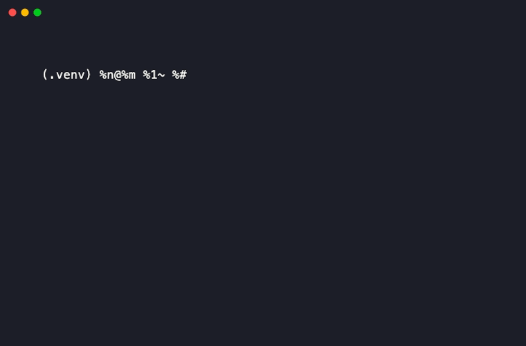

<!-- mcp-name: io.github.RudrenduPaul/swarm-rd-orchestrator -->

<div align="center">

# swarm-rd-orchestrator-cli

[](https://pypi.org/project/swarm-rd-orchestrator-cli/)
[](https://www.npmjs.com/package/swarm-rd-orchestrator-cli)
[](LICENSE)
[](pyproject.toml)
[](test_event_log.py)
[](#locked-decisions-2026-08-03)

[Install](#install) • [Quickstart](#quickstart) • [Command reference](#command-reference) • [MCP Server](#mcp-server) • [Comparison](#comparison) • [FAQ](#faq)

**Ray-native context and memory sharing for parallel research agents, with an agent-native CLI and MCP server.**

</div>


An append-only, SQLite-WAL-backed event log wrapped as a Ray actor, so parallel agents can write findings and pull each other's without a shared mutable store, plus a CLI and MCP server so both humans and other agents can drive it directly.

This is a Milestone 1 prototype (2026-08-03): validate the approach on a real task before building further. See [Locked decisions](#locked-decisions-2026-08-03) below and `spike.py` for the actual validation harness.

## Install

```bash
pip install swarm-rd-orchestrator-cli
# or
npm install -g swarm-rd-orchestrator-cli
```

Either gives you a `swarm-rd-cli` command on your `PATH`. The npm package is a thin wrapper around the Python CLI: it execs the real binary, it does not reimplement it. Install the Python package too if you use the npm one.

**Status:** live on both registries (PyPI published via GitHub Actions OIDC, no stored token). Both were verified with a real install and a real command run in a clean environment, not just a successful upload.

> [!WARNING]
> This is a pre-validation Milestone 1 spike (`0.0.x`), not yet a stable release. Tested on macOS only; Windows support is unverified since Ray's own Windows support is more limited than Linux/macOS upstream.

## Quickstart

```bash
swarm-rd-cli append task-1 agent-a "found a race condition in the retry loop" --kind result
swarm-rd-cli append task-1 agent-b "confirmed: retry loop isn't holding the lock" --kind result
swarm-rd-cli pull task-1
# [1] (agent-a/result) found a race condition in the retry loop
# [2] (agent-b/result) confirmed: retry loop isn't holding the lock

swarm-rd-cli --json pull task-1     # structured output for scripts/agents
swarm-rd-cli list-tasks             # every task_id with a delta count
swarm-rd-cli mcp                    # run as an MCP server over stdio
```

Every data-returning command supports `--json` for agent and script consumption, no screen-scraping required. The `mcp` subcommand exposes `append_delta`, `pull_deltas`, and `list_tasks` as typed MCP tools over stdio, so an agent can call this programmatically instead of shelling out.

## Features

- **Atomic append, proven, not just claimed.** A dedicated test simulates a crash mid-write and confirms the SQLite WAL layer leaves zero partial rows, not just a description of the guarantee.
- **Structured output on every data command.** `--json` on `append`, `pull`, and `list-tasks` means an agent shelling out to this CLI never has to screen-scrape human-formatted text.
- **An MCP server, not just a CLI.** `swarm-rd-cli mcp` exposes the same three operations as typed tools over stdio, so an agent can call this programmatically instead of spawning a subprocess.
- **Concurrency tested with real Ray actors, not mocked.** The load-bearing test runs 3 actual Ray actors appending concurrently and reconciles the result, the same mechanism the real workload uses.
- **Malformed input fails loudly.** A delta missing `task_id`, `agent_id`, or `content` raises `InvalidDeltaError` before touching storage. No silent drops.

## Command reference



Generated from the CLI's own `--help` output:

```
usage: swarm-rd-cli [-h] [--db DB] [--json] {append,pull,list-tasks,mcp} ...

positional arguments:
  {append,pull,list-tasks,mcp}
    append              append a delta to the event log
    pull                pull deltas for a task
    list-tasks          list every task_id with a delta count
    mcp                 run as an MCP server over stdio

options:
  -h, --help            show this help message and exit
  --db DB               path to the event log (default: swarm-events.db)
  --json                structured JSON output (for agent/script use)
```

```
usage: swarm-rd-cli append [-h] [--kind {note,result,tool_output}]
                            task_id agent_id content

positional arguments:
  task_id
  agent_id
  content

options:
  -h, --help            show this help message and exit
  --kind {note,result,tool_output}
```

```
usage: swarm-rd-cli pull [-h] [--since SINCE] task_id

positional arguments:
  task_id

options:
  -h, --help     show this help message and exit
  --since SINCE  cursor to pull after
```



## MCP Server

`swarm-rd-orchestrator-cli` ships a Model Context Protocol (MCP) server, so an agent can call the event log directly as typed tools over stdio instead of shelling out to the CLI and parsing text.

```bash
pip install "swarm-rd-orchestrator-cli[mcp]"
```

Run it with:

```bash
swarm-rd-cli mcp
```

Add it to Claude Desktop (or any other MCP client) by pointing it at that command in your config:

```json
{
  "mcpServers": {
    "swarm-rd-orchestrator": {
      "command": "swarm-rd-cli",
      "args": ["mcp"]
    }
  }
}
```

Three tools are exposed:

- **`append_delta(task_id, agent_id, content, kind="note")`** - append a finding/result/tool-output to the event log for a task. Example: `append_delta(task_id="task-1", agent_id="agent-a", content="found a race condition in the retry loop", kind="result")`.
- **`pull_deltas(task_id, since_cursor=0)`** - pull every delta for a task with id greater than `since_cursor`, oldest first. Example: `pull_deltas(task_id="task-1")` returns the full history; `pull_deltas(task_id="task-1", since_cursor=2)` returns only deltas written after cursor 2.
- **`list_tasks()`** - list every `task_id` currently in the event log with its delta count. Example: `list_tasks()` returns `[{"task_id": "task-1", "delta_count": 2}]`.

## Comparison

`swarmmesh` is a sibling project in this author's portfolio, also published as `swarmmesh-cli` on PyPI and npm. It's the more complete option today on almost every dimension below. This project exists as a deliberately Ray-native alternative, not because swarmmesh falls short.

| | swarm-rd-orchestrator-cli | swarmmesh-cli |
|---|---|---|
| Transport | Ray actor (in-process / distributed) | HTTP server |
| Storage | SQLite, WAL mode | In-memory by default, or SQLite via `--persist` |
| Cross-language | Python only | Python and Node |
| Memory search/ranking | None (pull by `task_id` only) | BM25 keyword ranking on memory queries |
| MCP server | Yes | Yes |
| Published on PyPI/npm | Yes, live | Yes, live |
| CI | Yes | Yes |

If the Ray-native distributed-compute angle doesn't end up mattering for your use case, use `swarmmesh` instead. It's live, tested against real usage, and does more.

## What is swarm-rd-orchestrator-cli, and why does it exist

`swarm-rd-orchestrator-cli` is a shared, durable event log for parallel AI research agents built on Ray's actor model. Each agent writes findings as structured deltas; any other agent can pull the full history for a task without a shared mutable store or a coordinating server process.

It exists to test a specific, narrow hypothesis: that Ray's actor and object-store model is a better fit for coordinating genuinely large numbers of parallel research agents than an HTTP-based coordination layer. That hypothesis is unproven. The project ships as a Milestone 1 spike specifically to test it against a real workload before any further investment, see [Run the actual validation spike](#run-the-actual-validation-spike).

## Build from source

```bash
git clone https://github.com/RudrenduPaul/swarm-rd-orchestrator.git
cd swarm-rd-orchestrator
python3 -m venv .venv
.venv/bin/pip install -e ".[dev,mcp]"
```

Requires Python 3.10 or newer (needed for the `mcp` SDK dependency).

## Run the tests

```bash
.venv/bin/pytest test_event_log.py -v
```

9/9 passing, including the load-bearing test: 3 concurrent Ray actors appending to one shared event log, reconciled with zero lost or duplicated deltas.

## Run the actual validation spike

Edit `REAL_TASK_ID`, `REAL_TASK_DESCRIPTION`, and the sample agent findings in `spike.py` to reflect a real research task, then:

```bash
.venv/bin/python3 spike.py
```

Read the printed rubric at the end. The decision rule: fewer than 3 qualifying architectural failure cases against raw Ray or LangGraph means falling back to a thin CLI wrapper instead of building this out further.

## Locked decisions (2026-08-03)

- Primitive: Ray (actor model and object store), LangGraph as fallback
- Storage: SQLite, WAL mode
- Delta shape: `{task_id, agent_id, timestamp, content, kind}`
- Malformed delta raises `InvalidDeltaError`, never silent
- License: Apache 2.0
- Python: 3.10 or newer, required for the `mcp` SDK
- Publishing: live on [PyPI](https://pypi.org/project/swarm-rd-orchestrator-cli/) (via GitHub Actions OIDC Trusted Publishing, no stored token) and [npm](https://www.npmjs.com/package/swarm-rd-orchestrator-cli), both verified with a real clean-environment install

## FAQ

**What does this actually do?**
It gives parallel AI agents, running as Ray actors, a shared and durable place to write findings and pull each other's, without stepping on each other's state. It's a transport and persistence layer, not an orchestration framework: it doesn't schedule agents or decide what they do.

**How is this different from `swarmmesh`?**
See [Comparison](#comparison) above. Same core idea, different transport (Ray actors instead of HTTP), and `swarmmesh` is currently the more complete, already-published option.

**Does this work on Windows, macOS, and Linux?**
Tested on macOS. Ray itself supports Linux and macOS natively; Windows support for Ray is more limited upstream, so treat Windows as unverified for this project specifically until someone confirms it.

**Does this need my own API keys?**
No. This project makes no LLM calls of its own. It's a coordination layer that your own agents, whatever model or framework they use, write to and read from.

**Is this safe to depend on?**
No, not yet. This is a pre-validation Milestone 1 spike (versions `0.0.x`), not a stable release. The event log's core guarantees (atomic append, no partial writes) are tested in `test_event_log.py`, but the project hasn't been validated against a real multi-agent workload beyond the spike script yet.

**How do I use this from an agent, not just a human?**
Either shell out to the CLI with `--json` on every command, or run `swarm-rd-cli mcp` and connect to it as an MCP server. Both give structured, parseable output.

**Is this a library or just a CLI?**
Both. `event_log.py`'s `EventLog` and `EventLogActor` classes are directly importable if you're already in Python and don't need the CLI or MCP layer.

**What license is this under, and can I use it commercially?**
Apache 2.0. Commercial use, modification, and redistribution are all permitted under its terms; see [LICENSE](LICENSE) for the full text.

## Contributing

There's no `CONTRIBUTING.md` yet since this is a pre-validation spike, not an accepted-contributions project. Open an issue if you want to discuss a change before this exists formally.

## License

Apache 2.0. See [LICENSE](LICENSE) for the full text.
